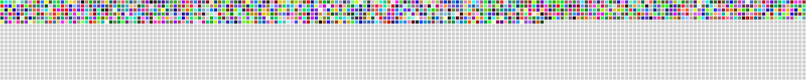

# Hi there 👋 How are you doing

### Did you know? the average human life spans 4,000 weeks.
❓ **Do you have statistics about how you use?**

So far, I do. For me, it was approximately NaN% of my life; It was the beginning of the career period. And I've decided to use it as *Software developer*. 

📊 So, this graph represents my remaining life time spent attempting to improve and learn new things every day.

## ⭐️ GitHub Stats

## 💻 Favorite Tech
🔬 Tools, languages, and other things that I like to work with.

## Where to find me

### 📝 Latest Blog Posts

<!-- MEDIUM:START -->

<!-- MEDIUM:END -->

 
⏰ Updated on: Mon Apr 22 2024 07:15:08 GMT+0000 (Coordinated Universal Time)
