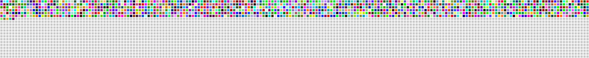

# Hi there 👋 How are you doing

### Did you know? the average human life spans around 4,000 weeks.
❓ **Do you satisfied how you use?**

So far, I do. For me, it was approximately 29% of my life; It was the beginning of the career period. And I've decided to use it as *Software developer*. 

📊 So, this graph represents my remaining life time spent attempting to improve and learn new things every day.

## ⭐️ GitHub Stats

## 💻 Favorite Tech
🔬 Tools, languages, and other things that I prefer to work with.

## Where to find me

### 📝 Latest Blog Posts

<!-- BLOG:START -->
<!-- MEDIUM:START -->
- [How to create Python Flask API with auto generate API document ง่าย ๆ ไม่ต้องเขียนเอง](https://iricea.medium.com/how-to-create-python-flask-api-with-auto-generate-api-document-%E0%B8%87%E0%B9%88%E0%B8%B2%E0%B8%A2-%E0%B9%86-%E0%B9%84%E0%B8%A1%E0%B9%88%E0%B8%95%E0%B9%89%E0%B8%AD%E0%B8%87%E0%B9%80%E0%B8%82%E0%B8%B5%E0%B8%A2%E0%B8%99%E0%B9%80%E0%B8%AD%E0%B8%87-4f01451ff2f7?source=rss-ac050ee7629f------2)
- [TypeScript กับ bull และเรื่องปวดหัวของ type](https://iricea.medium.com/typescript-%E0%B8%81%E0%B8%B1%E0%B8%9A-bull-%E0%B9%81%E0%B8%A5%E0%B8%B0%E0%B9%80%E0%B8%A3%E0%B8%B7%E0%B9%88%E0%B8%AD%E0%B8%87%E0%B8%9B%E0%B8%A7%E0%B8%94%E0%B8%AB%E0%B8%B1%E0%B8%A7%E0%B8%82%E0%B8%AD%E0%B8%87-type-c5aac350e39e?source=rss-ac050ee7629f------2)
<!-- MEDIUM:END -->
<!-- BLOG:END -->

 
⏰ Updated on: Mon Oct 28 2024 01:46:27 GMT+0000 (Coordinated Universal Time)

 

To use this template, you can check [here](docs/SETUP_INSTRUCTION.md)
